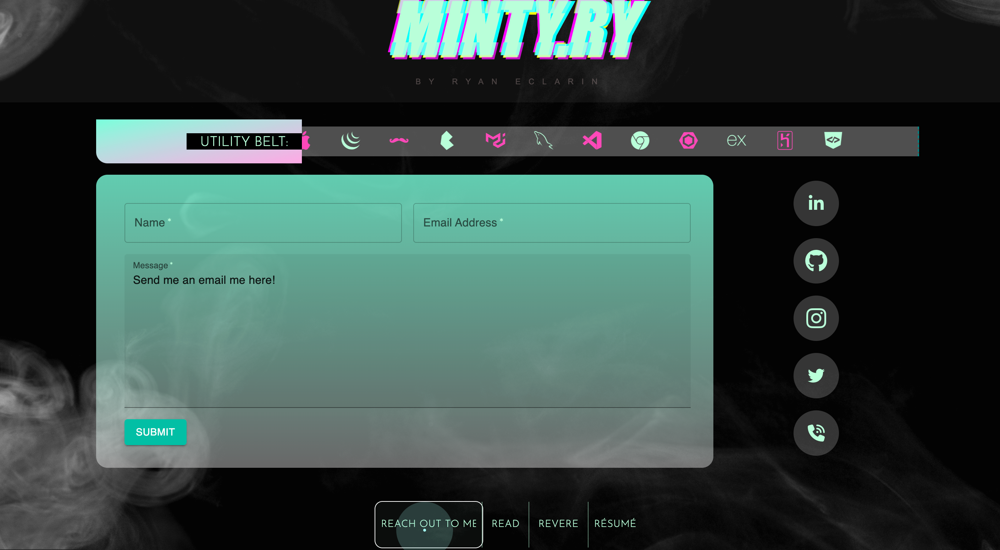

# Minty.Ry.Portfolio 2.0

## Description 📰

Welcome to the Minty.Ry Portfolio 2.0 by Ryan Eclarin, made with React!
In this portfolio, the user is greeted with a welcome message, in which I profess that this portfolio is my horcrux -- I've put my soul into this.
After the welcome message fades out, the user is brought home, where they see my self-portrait, floating links to my github and LinkedIn, and a nav bar at the foot of the page, where you can reach out to me (contact), read about me, revere my work (projects), and review my résumé.

My motivation for this portfolio was to convey my passion as well as the accumulation of my development skillset up to this point with React. I also learned a plethora of new things along the way: use Material UI, CSS animations, aniamted cursors, Formspree, and so much more! The logic of conditionally rendering compoents, as well as intentionally delaying stateful changes were some of the keys that allowed me to produce the fruits of my labor.

Please enjoy the journey that went into making this portfolio: 
[https://minty-ry-portfolio.netlify.app/work](https://minty-ry-portfolio.netlify.app/)

## Table of Contents

&nbsp;&nbsp;&nbsp;&nbsp;&nbsp;&nbsp; ➣ [Installation](#Installation)

&nbsp;&nbsp;&nbsp;&nbsp;&nbsp;&nbsp; ➣ [Usage](#Usage)

&nbsp;&nbsp;&nbsp;&nbsp;&nbsp;&nbsp; ➣ [Contributing](#Contributing)

&nbsp;&nbsp;&nbsp;&nbsp;&nbsp;&nbsp; ➣ [Tests](#Tests)

&nbsp;&nbsp;&nbsp;&nbsp;&nbsp;&nbsp; ➣ [Credits](#Credits)

&nbsp;&nbsp;&nbsp;&nbsp;&nbsp;&nbsp; ➣ [Questions](#Questions)

## Installation 🔌

n/a

## Usage 🧮

In the Minty.Ry Portfolio 2.0, the user is greeted with a welcome message that fades into the homepage, where they see the self-portrait and floating links for my Github and LinkedIn. The header presents my alias, which serves as a home button, and the footer navigates to a contact section, a bio section, a projects section, and a résumé section.
PS: If the user wishes, they can click anywhere in the welcome screen to bypass the message.
 

The contact section features a Formspree contact form where the user can easily send me an email; each field will alert the user they are required to be filled out. There are also links to various platforms where you can reach me (please check out my Twitter link!).

The bio section briefs the user on who I am and my passion for coding.

The work section renders an image quilt that will display information about my most prized projects thus far.

The résumé section displays a downloadable PDF. On mobile, those controls can be lost, so as a fallback, I've also made the resume linked so once the user clicks it, it will also download.

## Contributing 🍴

Dont fork this.

## Tests ⚖️

n/a

 ## Credits 🤝

glitch text: https://freefrontend.com/css-text-glitch-effects/, Christine Banlawi 

black smoke image : https://www.freepik.com/free-photo/abstract-wallpaper-background-design-dark-design_19097927.htm#query=black%20smoke%20background&position=2&from_view=keyword&track=ais&uuid=ad20abc0-0fa2-4798-adde-a91e754e5347, Image by rawpixel.com on Freepik 

image overlay for work and if statement to remove extra quilt images gracefully, Xpert AI 

avatar border animation: https://codepen.io/t_afif/pen/JjLVLPL for avatar border animation

## Questions 📭

Please enjoy my work at my GitHub, @[minty.ry](https://github.com/minty.ry).
